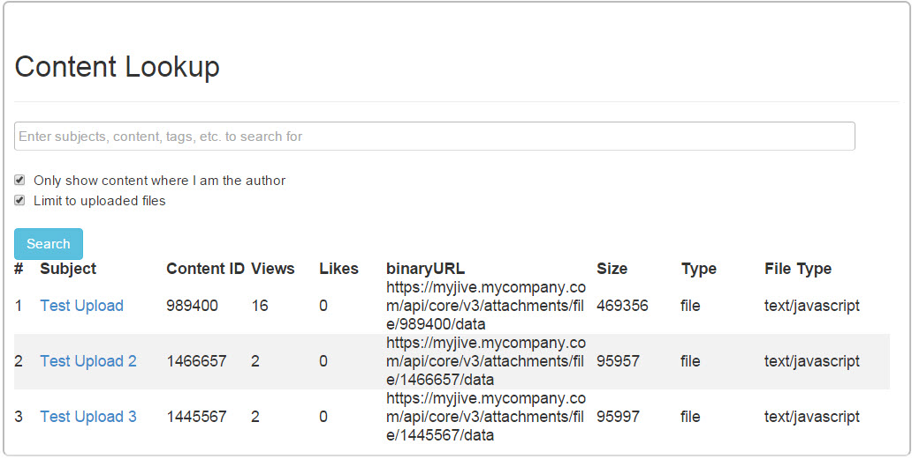

Jive - Content Lookup
=====================



This widget is the starter widget in a series of releases that adds tremendous flexibility for finding and displaying information on overview pages.  The Content Lookup widget is a handy tool for quickly locating content in your Jive community and obtaining various stats and reference information.  This is a [Jive-n](https://community.jivesoftware.com/welcome) HTML widget project that creates a self-service portal that allows users to more easily search for specific content and get pertinent information about it.  It utilizes the Jive V3 search API and presents a clean user interface using [Bootstrap](http://getbootstrap.com/).  In particular, this widget makes getting the content ID to uploaded files in the Jive instance much easier than doing API lookups in the browser and parsing the returned information for that level of detail.


Prerequisite
------------
This widget can only be used on Jive installations that have JavaScript enabled in HTML widgets (Jive-n and some Jive-x).  Also, it must be decided where the required library files will be stored in your installation.  Read [prerequisite](docs/prerequisite.md) for more information.

The below installation looks very long and complicated.  It is a bit long, but this will ease the install for the other widget projects in this series (Accordion, Carousel, Form, Presentation, Search, etc.) and is aimed at easing the user experience of those utilizing these self-service portals.  All the setup work below will make installing future widgets less complicated, allow the adding of features and fixing of bugs without forcing users to regenerate their widgets, make the use of the widgets a simple process, and has several other benefits.  Let's begin the installation...


Download Bootstrap
------------------
[Bootstrap](http://getbootstrap.com/) is a library that this widget series use for the user interface.  You need to obtain a copy of this library and store specific files in your Jive instance for use.  Follow these instructions to download the latest version and upload to your community:

* Go to [Bootstrap](http://getbootstrap.com/) or use a version used by your front end developers and skip to step 5.
* Click on Download Bootstrap.
* On the download page under Bootstrap, click the Download Bootstrap button.  The full Bootstrap library will be downloaded to you in a zip file.
* (Optional) Perform any required security checks on the downloaded code.
* Extract the zip file to your computer.

Upload Bootstrap Files
----------------------
* Expand the bootstrap distribution folder.
* Expand the css folder.
* Log into your Jive community.
* Navigate to the upload location for your library files.
* Create an Uploaded File.  Drag the file "bootstrap.min.css" from your temp folder to the file section of the upload.  Set the file name to "Bootstrap CSS Library", put a description of your choosing, tag it with something agreeable to your community manager, and other options such as setting authors for controlling updates.  Make sure you are publishing it to the agreed upon Library location in your community.  Click Publish.
* Once published, right-click the Download link on the page, and copy the link address.
* Edit the "content_lookup.html" file in this repository.
* Find the line:
```
    <link rel='stylesheet' href='BOOTSTRAP CSS LiBRARY'>
```
&nbsp;&nbsp;&nbsp;&nbsp;replace the text inside the href quotes with the URL you just copied above.  It should end up looking similar to:
```
    <link rel='stylesheet' href='https://myjiveinstance.mycompany.com/servlet/JiveServlet/downloadBody/421109-102-2-1031405/bootstrap.min.css'>
```
* Create another Uploaded File in your Jive community.  Drag the file "bootstrap-theme.min.css" from your temp folder to the file section of the upload.  Set the file name to "Bootstrap Theme CSS Library", put a description of your choosing, tag it, set the authors, and make sure it is being published to the correct Library location.  Click Publish.  You will not need to do anything else with this file right now.
* Go back to the Bootstrap folder on your local computer and navigate back up a folder, and then expand the js folder.
* Create another Uploaded File for this library.  Drag the file "bootstrap.min.js" from your temp folder to the file section of the upload.  Set the file name to "Bootstrap JavaScript Library", put a description of your choosing, tag it, set the authors, and make sure it is being published to the correct Library location.  Click Publish.
* Once "bootstrap.min.js" is published, right-click the Download link on the page, and copy the link address.
* Edit the "content_lookup.html" file again and find the line:
```
    <script src='BOOTSTRAP JS LIBRARY'></script>
```
&nbsp;&nbsp;&nbsp;&nbsp;replace the text inside the src quotes with the URL you just copied above.  It should end up looking similar to:
```
    <script src='https://myjiveinstance.mycompany.com/servlet/JiveServlet/downloadBody/421109-102-2-1031405/bootstrap.min.js'></script>
```
* Save the edits to "content_lookup.html"
* Go to the site you want to put the Content Lookup widget in your community, and go to the Overview page.
* Manage the Overview page, and drag a new HTML widget onto the page.
* Edit the new HTML Widget.
* Copy the updated code from "content_lookup.html" and paste it into the "Your HTML" entry field in the new widget.
* Click "Save Properties". 
* Click "Publish Layout".  Once published, you should have an operational Content Lookup widget.
* Test it by entering "Bootstrap" in the search field, leave both checkboxes checked, and click Search.  It should come back with the three Bootstrap libraries you uploaded to your community above (and possibly more).  If not, check out [Issues](docs/issues.md)

Now that you have a working Content Lookup widget, we will use it to make life a bit easier for us going forward...

Install Library Loader
----------------------
* Look at the "Bootstrap" search results (from step 26 in the previous section).  Find the line for "Bootstrap CSS Library" and make a copy of the Content ID.  It is the number in the second column, and should be something like "694220".
* Go back to the Content Lookup widget folder on your computer and edit the file "library_loader.js".
* Find the line for the bootstrap.css entry:
```
	libraries['bootstrap.css'] = { contentID: '0' };
```
&nbsp;&nbsp;&nbsp;&nbsp;update the contentID with the value you just copied above.  It should end up looking similar to:
```
	libraries['bootstrap.css'] = { contentID: '694220' };
```
* Go back to the Content Lookup search results.  Find the results for "Bootstrap Theme CSS Library" and make a copy of the Content ID.
* Update "library_loader.js" by changing the bootstrap-theme.css entry:
```
	libraries['bootstrap-theme.css'] = { contentID: '0' };
```
&nbsp;&nbsp;&nbsp;&nbsp;update the contentID with the value you just copied above.  It should end up looking similar to:
```
	libraries['bootstrap-theme.css'] = { contentID: '694221' };
```
* Go back to the Content Lookup search results.  Find the results for "Bootstrap JavaScript Library" and make a copy of the Content ID.
* Update "library_loader.js" by changing the bootstrap.js entry:
```
	libraries['bootstrap.js'] = { contentID: '0' };
```
&nbsp;&nbsp;&nbsp;&nbsp;update the contentID with the value you just copied above.  It should end up looking similar to:
```
	libraries['bootstrap.js'] = { contentID: '694222' };
```
* Save the edits to your "library_loader.js" file on your local computer.
* Create another Uploaded File in your Library File Location.  Drag the "library_loader.js" file from your computer to the file section of the upload.  Set the file name to "Library Loader", put a description of your choosing, tag it, set the authors, and make sure you are publishing it to the agreed upon Library location in your community.  Click Publish.
* Go back to the Content Lookup widget in your Jive community.  Search for "Library Loader".  Once it is returned in the search, proceed to the next installation section.


Use the Library Loader
----------------------
* Look at the Content Lookup search results from the end of the last section.  On the "Library Loader" line, instead of copying the Content ID, this time we need to make a copy of the Binary URL.  It should look something like:
```
	https://myjiveinstance.mycompany.com/api/core/v3/attachments/file/694223/data
```
* Edit the file "content_lookup.html" on your local computer again.
* Delete the line for the bootstrp.min.css you edited earlier.  It looks similar to:
```
    <link rel='stylesheet' href='https://myjiveinstance.mycompany.com/servlet/JiveServlet/downloadBody/421109-102-2-1031405/bootstrap.min.css'>
```
&nbsp;&nbsp;&nbsp;&nbsp;completely remove that line.
* Change the src URL in the next line to the Binary URL you copied above.  It should change from looking similar to:
```
    <script src='https://myjiveinstance.mycompany.com/servlet/JiveServlet/downloadBody/421109-102-2-1031405/bootstrap.min.js'></script>
```
&nbsp;&nbsp;&nbsp;&nbsp;to something similar to:
```
    <script src='https://myjiveinstance.mycompany.com/api/core/v3/attachments/file/694223/data'></script>
```
* Paste the following code directly beneath that line:
```
	<script>
	$j.load_library('bootstrap.css');
	$j.load_library('bootstrap.js');
	</script>
```
&nbsp;&nbsp;&nbsp;&nbsp;the top of the code should look similar to:
```
	<meta name='fidosreg' content='b764a0a9536448345dc227af95e192521d337b5e4c3560c859b89ecd0407004a'>

	<script src='/resources/scripts/jquery/jquery.js'></script>
    <script src='https://myjiveinstance.mycompany.com/api/core/v3/attachments/file/694223/data'></script>
	<script>
	$j.load_library('bootstrap.css');
	$j.load_library('bootstrap.js');
	</script>
```
* Save the changes to "content_lookup.html"
* Copy the code to update the widget in your community.
* Go to the Content Lookup widget page in your Jive community.
* Manage the overview page.
* Edit the Content Lookup widget.
* Replace all the code in the widget to the code you just copied.
* Save the properties.
* Publish your changes.

Make sure the widget works using the Library Loader changes by searching for "Bootstrap" again.  It should return the same library files it did earlier.  If not, go back and double-check the above directions.

Install jQuery
--------------
Jive includes a version of jQuery in its installation, which this widget uses initially, but the version Jive includes may be too old to be used with the newer JavaScript libraries (like the latest Bootstrap).  While the Content Lookup widget should basically work with the included jQuery, many widgets will error out and not work.  We need to put a newer version of the library in the Jive instance to be used by these widget projects.  If you are knowledgeable about the library versions on your Jive instance, and know that your jQuery version is a late enough version, then it is assumed you can leave the included version already in your instance.  Otherwise, follow these instructions to download a compatible version, upload the file into your Jive instance, and modify the widget code to use it:

* Right click this link -> [jQuery](https://ajax.googleapis.com/ajax/libs/jquery/1.11.3/jquery.min.js)
* Select "Save Target as" or "Save Link as" (depending on browser)
* Save the file to your local computer.
* (Optional) Perform any required security checks on the downloaded code.
* Log into your Jive community.
* Navigate to the upload location for your library files.
* Create an Uploaded File.  Drag the downloaded jQuery library file from your download folder to the file section of the upload.  Set the file name to "jQuery Library", put a description of your choosing, tag it with something agreeable to your community manager, and other options such as setting authors for controlling updates.  Make sure you are publishing it to the agreed upon Library location in your community.  Click Publish.
* Once published, go to your Content Lookup widget page and search for "jQuery Library".
* Copy the returned Binary URL.  It should look similar to:
```
	https://myjiveinstance.mycompany.com/api/core/v3/attachments/file/694224/data
```
* Edit the "content_lookup.html" file in this repository.
* Find the line:
```
    <script src='/resources/scripts/jquery/jquery.js'></script>
```
&nbsp;&nbsp;&nbsp;&nbsp;replace the text inside the src quotes with the Binary URL you just copied.  It should end up looking similar to:
```
    <script src='https://myjiveinstance.mycompany.com/api/core/v3/attachments/file/694224/data'></script>
```
&nbsp;&nbsp;&nbsp;&nbsp;the top of the code should look similar to:
```
	<meta name='fidosreg' content='b764a0a9536448345dc227af95e192521d337b5e4c3560c859b89ecd0407004a'>

	<script src='https://myjiveinstance.mycompany.com/api/core/v3/attachments/file/694224/data'></script>
    <script src='https://myjiveinstance.mycompany.com/api/core/v3/attachments/file/694223/data'></script>
	<script>
	$j.load_library('bootstrap.css');
	$j.load_library('bootstrap.js');
	</script>
```
* Save the edits to your "content_lookup.html" file on your local computer.
* Copy the code in the file "content_lookup.html".
* Go to the Content Lookup widget page.
* Edit the Content Lookup widget.
* Paste the code you just copied above into the widget entry.
* Click Save Properties.
* Publish your page.  Test the widget again to make sure it is operational.

Congratulations, you are done setting up this widget!


Usage
-----
Users can now search for content by doing ther following:

1. In the entry field, specify search criteria to narrow down the search to the intended content in your Jive instance.  The criteria entered can be terms from the subject, content, tags, etc.  This widget uses the Jive V3 search API, so the normal search rules from the search screen in Jive apply here.
2. If you are searching for content that you authored, narrow the search by checking the box "Only show content where I am the author".  Otherwise, leave the box unchecked to find content authored by anyone.
3. If you only want to find uploaded files, check the box "Limit to uploaded files".  Otherwise, leave the box unchecked to find content of any type.
4. Click the Search button.

The search results will be returned in tabular format, with one row per result.  The columns returned are:

- # - Result number.
- Subject - The subject or title of the content.
- Content ID - The Jive content ID.
- Views - The number of views the content has gotten.
- Likes - The number of likes the content has gotten.
- binaryURL - The binaryURL of the content.  This can be used to include JavaScript and css libraries hosted on your Jive instance.  Since the binaryURL does not change, even when the uploaded files are modified, this is handy to set once in your code and future updates to the libraries will automatically be pulled in by widgets.  This cannot be utilized outside of the Jive instance, though, as there is no Jive servlet set up to service it (unlike the Download and Preview links on the download page).
- Size - File size in bytes (only for uploaded content)
- Type - Type of content.
- File Type - The type of uploaded file.


Issues
------
If your widget is not working as expected, please check out [Issues](docs/issues.md)


Additional Jive-n widget projects in this series
------------------------------------------------
* [Accordion widget](https://github.com/fmr-llc/jive-accordion)
* [Content Viewer widget](https://github.com/fmr-llc/jive-content-viewer)
* [Export widget](https://github.com/fmr-llc/jive-export-followers)
* [Form widget](https://github.com/fmr-llc/jive-form)
* [Form Report widget](https://github.com/fmr-llc/jive-form-report)
* [Menu Bar widget](https://github.com/fmr-llc/jive-menu)
* [Picture Carousel widget](https://github.com/fmr-llc/jive-picture-carousel)
* [Presentation widget](https://github.com/fmr-llc/jive-presentation)
* [Search widget](https://github.com/fmr-llc/jive-advanced-search)
* [Team Listing widget](www.github.com/fmr-llc/jive-team-listing)


Contributing
------------
If you would like to contribute to this project, please check out [Contributing](docs/contributing.md)


License
-------
(c) 2015-2016 Fidelity Investments
Licensed under the [Apache License](docs/LICENSE), Version 2.0